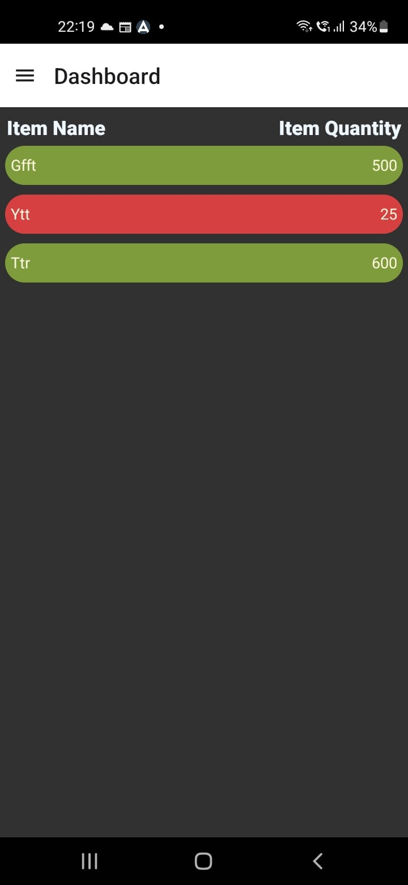
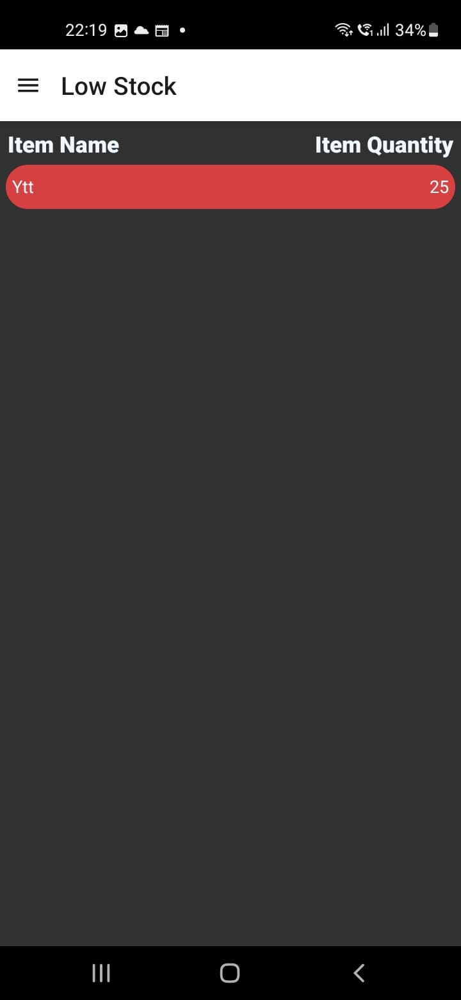
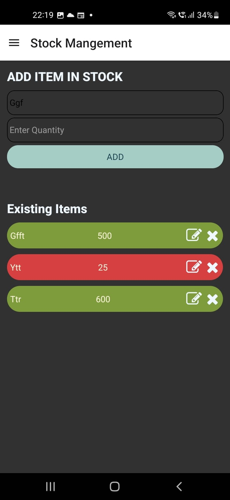

# Store Manager 📦

A mobile inventory management app built with React Native and TypeScript, designed to help small businesses track their stock offline.


## Features ✨
- **Offline First:** Full functionality without internet using SQLite
- **Dashboard Overview:** 
  - View all stock items with key details
  - Quick access to critical information
- **Low Stock Alerts:** 
  - Automatic detection of items needing restock
  - Dedicated view for urgent items
- **Inventory Management:** 
  - Add new products with details
  - Edit existing items
  - Remove discontinued stock
- **Local Storage:** All data persists on device

## Screenshots 📸

| Dashboard | Low Stock | Management |
|-----------|-----------|------------|
|  |  |  |

## Tech Stack 🛠️
- **React Native** - Cross-platform mobile framework
- **TypeScript** - Type-safe JavaScript implementation
- **SQLite** - Local database for offline storage
- **CLI** - Development platform 

## Getting Started 🚀

### Prerequisites
- Node.js (v14+)
- npm/yarn
- Android Studio and Java

### Installation
1. Clone the repository
   ```bash
   git clone https://github.com/your-username/store-manager.git
Install dependencies

```bash
npm install
```
Start the development server

```bash
npm start
```
Running the App
Android: Press a in the terminal after starting

iOS: Press i in the terminal after starting

Physical Device or emulator should be connected

Contributing 🤝
Contributions are welcome! Please open an issue first to discuss potential changes.